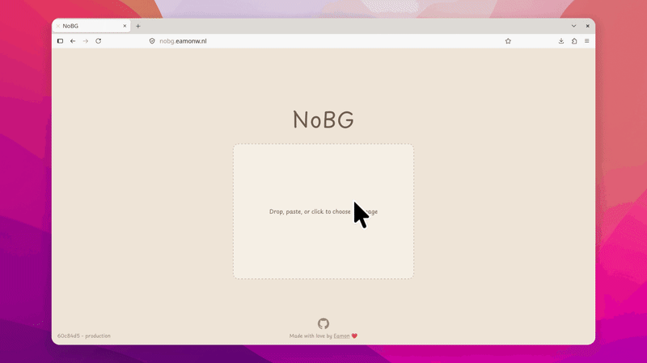

<div align="center">
  

  # NoBG

  The FOSS image background remover that shouldn't need to exist.
  
  [](https://www.codefactor.io/repository/github/eamonwatson/nobg)
</div>

## Demo



## Run Locally

Clone the project

```bash
  git clone https://github.com/eamonwatson/nobg.git
```

Go to the project directory

```bash
  cd nobg
```

Install dependencies

```bash
  pnpm install
```

Start the server

```bash
  pnpm run start
```


## Support

For support, email eamon@vantern.org.


## Authors

- [@eamonwatson](https://www.github.com/eamonwatson)
## Contributing

Contributions are always welcome!

See `contributing.md` for ways to get started.

Please adhere to this project's `code of conduct`.


## License

[AGPL-3.0](https://choosealicense.com/licenses/agpl-3.0/)
